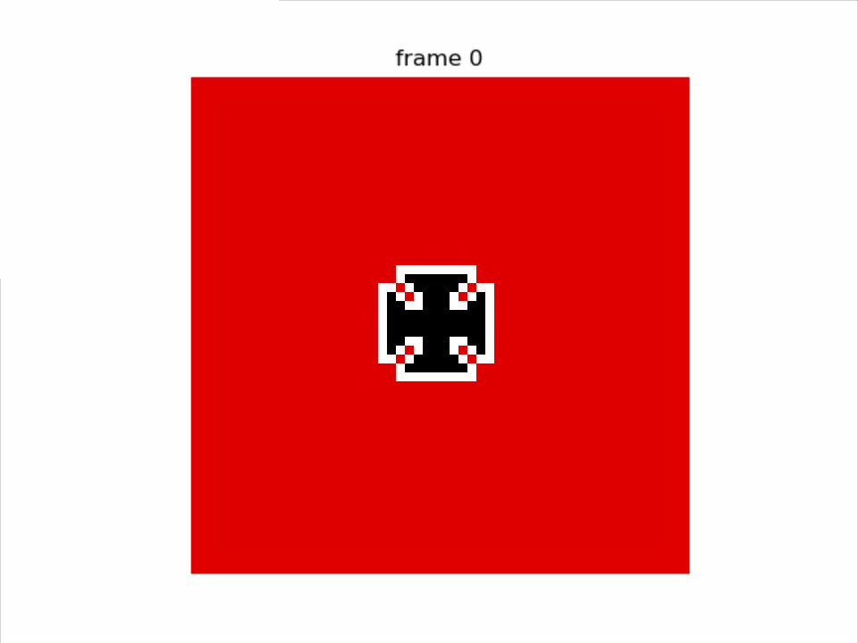

# Image_of_life
an implementation of game of life on images
To run it just download it and run it with your favorite python interpreter (I use pycharm). 
Modify parameters.json to change the algorithm behavior.  
  
**Death color** define which color on the picture will be considered as dead cells  
can be : "black", "white", "red", "blue", "green"  
  
**Tolerance** define the tolerance of the algorithm for interprenting color as dead cells  
it's an integer between 0 and 255*3  
  
**img_file** will be the name of the image you want the algorithm to use. The image HAS TO BE in the input_images folder and in .jpg format.
value : "image_name.jpg"  
  
**delta_t** is the time waited between each iteration of the algorithm  
value : a float number representing the nb of second  
  
**iterations** the nb of frame that will perform the algorithm  
value : a positive integer  
  
**rules** :  
**death** is the number of living cells around another living cells that will makes it die  
**birth** is the number of living cells around an dead cell that will makes it be born  
both are array of number between 0 and 8

